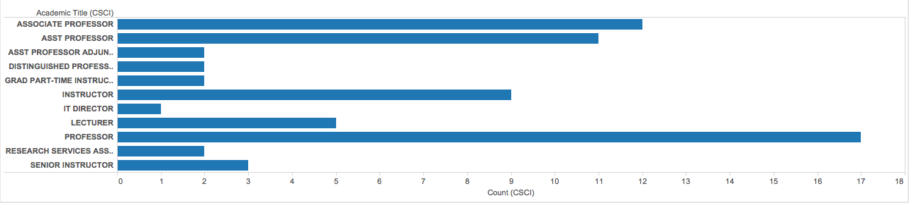

# Visualization

Using Tableau, create visualization for each question in the report. You will
work on this independently just like last week.

To include a Tableau visualization in your report, take a screenshot, save it as an image,
put it in the `learning/week2` folder, and replace ``  with
your own image. Please makes sure your screenshot includes the _entire_ Tableau interface
including the controls, widgets ...etc.

# Import

Data: [fcq.clean.json](https://github.com/bigdatahci2015/book/blob/master/hackathons/fcq/fcq.clean.json)

(a copy of this file is in your book repository already in the directory `hackathons/fcq`)

This dataset is provided to you in the JSON format. Your first task is to figure out
how to transform this JSON file into a format that can be fed into Tableau. As
a junior and senior, you are expected to be able to look around the Internet
to problem solve.

# Question 1 [Zachary Lamb]: How does retention compare across departments?

Figure 1-1: Academic *Departmental*  withdrawal rate comparison

MATH and APPM both have larger than average withdrawal rates... interesting

# Question 2 [Kevin Gifford]:  What is the ranking of Departments within the College of Engineering & Applied Sciences based on averaged course rating and average instructor rating?

Figure 2-1: Average Course Rating for the various CU-Boulder colleges.

Figure 2-2: Average *Course* Rating each College of Engineering Department.

Figure 2-3: Average *Instructor* Rating each College of Engineering Department.

Figure 2-4: ASEN Instructors with below average *Course* (average = 4.90)

Figure 2-5: ASEN Instructors with below average *Instructor* (average = 5.16)

# Question 3 [Karen Blakemore]: What is the distribution of instructor type (e.g., Lecturer, Assistant Professor, Instructor) across departments?

Figure 3-1: Distribution of *Academic Title* in the ASEN Department

Figure 3-2: Distribution of *Academic Title* in the CHEN Department

Figure 3-3: Distribution of *Academic Title* in the CSCI Department

# Question 4 [John Murphy]: Which class has the highest rating with the least amount of time spent each week?


/* First, extract all courses with the easiest work load */
var courses = _.groupBy(data, 'Workload.Hrs_Wk')['0-3']

/* Then, find those which have a 4.0 grade, remove duplicates and sort. */
return easy_As = _.unique(_.pluck(_.filter(courses, {'AVG_GRD': 4.0}), 'CourseTitle')).sort()


Table 4-1: Which class has the highest rating with the least amount of time spent each week?

<b>Easy A Courses</b>

<table>

    <tr>
        <td>{{course}}</td>
    </tr>

</table>

Table 4-1: Courses that are easy to get an "A" grade

# Question 5 [Andrew Linenfelser]: Which course level has the lowest retention?

Figure 5-1: Academic division withdrawal rate comparison

(write your explanation for the reader as to where to look at this chart in order
    to see the answer)    
